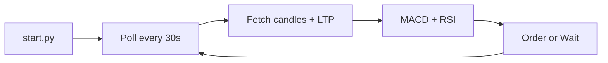
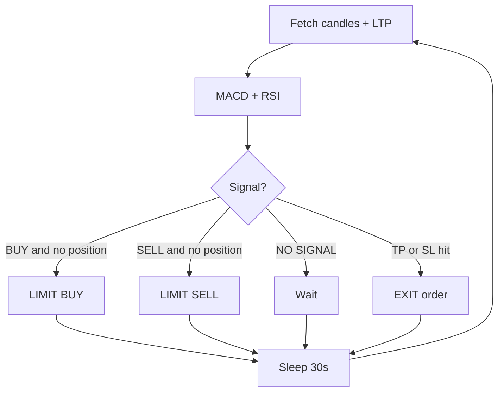

# MACD + RSI Bot — Architecture 

Simple flow of the algo. Use this as a speaking guide.

---

## 1. Big picture (30 seconds)

```text
You run:  python start.py
Bot does:  every 30s → fetch price → MACD + RSI → BUY / SELL / wait → place LIMIT order
You stop:  python stop.py
```



---

## 2. What each piece does

| Piece | Job |
|--------|-----|
| `.env` | Dhan login (`DHAN_CLIENT_ID`, `DHAN_ACCESS_TOKEN`) |
| `config/config.yaml` | Symbol, MACD/RSI, qty, TP/SL |
| `start.py` | Start one bot instance (port 7004) |
| `core/market_data.py` | Get candles + LTP via Dhan REST |
| `core/strategy.py` | Compute MACD + RSI → signal |
| `core/signal_engine.py` | Poll loop, TP/SL, place order |
| `core/order_manager.py` | LIMIT order via Dhan |
| `logs/trading.log` | Every poll recorded |

---

## 3. One poll cycle (the heart)

Every **30 seconds**:

1. **Fetch** last ~120 candles (5m) for HDFCBANK  
2. **Compute** MACD (12/26/9) and RSI (14)  
3. **Decide** signal  
4. **Check** open position + TP/SL  
5. **Place** LIMIT order if needed  
6. **Log** + show CLI dashboard  
7. **Sleep** 30s → repeat  



---

## 4. Signal rules (say this on camera)

**Default mode: MACD_RSI** (both must agree)

| Signal | Rule |
|--------|------|
| **BUY** | MACD line **above** Signal line **AND** RSI **> 60** |
| **SELL** | MACD line **below** Signal line **AND** RSI **< 40** |
| **NO SIGNAL** | Anything else → do nothing |

Only **one position** at a time. No duplicate entries on the same candle.

---

## 5. Simple example (walk through numbers)

Stock: **HDFCBANK** · Timeframe: **5m** · Qty: **10**

### Poll at 10:15:00

| Field | Value |
|-------|-------|
| Price (LTP) | 808.30 |
| MACD | -0.48 |
| Signal line | -0.56 |
| Histogram | +0.07 |
| RSI | 44 |

- MACD (−0.48) **>** Signal (−0.56) → MACD bullish  
- RSI 44 **not** > 60 → RSI not ready  
- **Result: NO SIGNAL** → wait  

### Poll at 10:20:00 (example BUY)

| Field | Value |
|-------|-------|
| Price | 815.00 |
| MACD | 1.20 |
| Signal line | 0.90 |
| RSI | 62 |

- MACD > Signal **and** RSI > 60 → **BUY**  
- Bot places **LIMIT BUY** at `815.00 + 0.10 = 815.10` (buffer)  
- Position = **LONG** · Qty = 10  

### Later — Take Profit / Stop Loss

Entry = 815.10  

| Event | Price | Rule | Action |
|-------|-------|------|--------|
| TP | ≥ 823.25 | +1% | EXIT (SELL) |
| SL | ≤ 811.03 | −0.5% | EXIT (SELL) |

---

## 6. How to run (demo ending)

```bash
# 1. Put credentials in .env
cp .env.example .env

# 2. Check config (symbol, paper_trade, qty)
# config/config.yaml

# 3. Start
python start.py

# 4. Watch logs (optional)
python logs.py

# 5. Stop
python stop.py
```

**Tip for video:** keep `paper_trade: true` while demoing — same flow, no live money.

---

## 7. One-line summary

> Every 30 seconds the bot reads HDFCBANK candles, checks if MACD and RSI agree on BUY or SELL, places a LIMIT order if needed, and exits on 1% profit or 0.5% loss.
